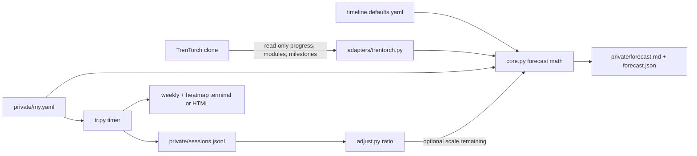

# trentorch-tracker

Roadmap and study timer for the TrenTorch curriculum. Standalone repo: it reads a TrenTorch clone and writes personal forecasts under `private/`. It never writes into the clone.

MIT licensed. Python 3.10+. CLI only. Optional PyYAML (falls back to a simple key: value parse).

## What it does

Two tools share one config and one personal data folder:

1. `tracker.py` estimates when you will finish the 20 modules and 6 milestones, and when you become proficient (Module 13, transformer built).
2. `tr.py` times real study sessions, splits regular vs overtime against a daily target, alerts once per day, and reports actuals against estimates. Optional auto-adjust scales remaining forecast hours when your pace drifts more than 10% from the base estimates.



In prose: the adapter only reads the clone; timeline defaults plus your config feed the forecast; the timer appends sessions beside the config; auto-adjust can feed observed pace back into remaining hours; personal outputs stay in `private/`.

## Setup

```
git clone <this-repo>
cd trentorch-tracker
# Python 3.10+ on PATH
# optional: pip install pyyaml pytest

copy private\my.example.yaml private\my.yaml
# edit private/my.yaml: trentorch_path, hours_per_week, days_per_week
```

`private/my.example.yaml` is tracked. `private/my.yaml`, sessions, and forecasts are gitignored.

## Config keys

| Key | Meaning | Default / example |
| --- | --- | --- |
| hours_per_week | Weekly study budget | 40 |
| days_per_week | Active days (5, 6, or 7) | 6 |
| off_day | Rest day name when not 7 days | sunday |
| start_date | Forecast start | 2026-09-15 |
| buffer_pct | Multiplier on estimate hours | 20 |
| skill_mult | Extra multiplier on estimates | 1.0 |
| trentorch_path | Path to your TrenTorch clone | required |
| auto_adjust | Scale remaining hours from observed pace | false |

Daily target minutes = `hours_per_week / days_per_week * 60`. Example: 40/6 is 400 minutes per day.

Invalid config (bad `days_per_week`, missing path, `skill_mult <= 0`) exits with code 2.

## Forecast

```
python tracker.py --update --config private/my.yaml
python tracker.py --update --config private/my.yaml --auto-adjust
python tracker.py --update --config private/my.yaml --trentorch-path C:/path/to/TrenTorch
python tracker.py --update --config private/my.yaml --skill-mult 1.2
```

Writes `private/forecast.md` and `private/forecast.json` beside the config. Stdout prints the proficient date, finish date, and daily load.

### Example paces

40h/week, 6 days, Sunday off, start 2026-09-15, 20% buffer:
- about 6.67h/day
- proficient 2026-11-03 (Module 13)
- finish 2026-12-11

10h/week, 5 days, same start and buffer:
- about 2.0h/day
- proficient 2027-02-25
- finish 2027-07-07 (about 50.6 weeks)

Weeks to finish stay the same when you switch 5/6/7 days at the same weekly hours. Daily load and calendar due dates move.

### Estimate controls

- `skill_mult` multiplies every module and milestone estimate hour.
- `--trentorch-path` overrides the clone path for one run.
- Milestone titles come from the clone `data/milestones/` when present. Hours still come from `timeline.defaults.yaml`.
- If `user_data/progress.json` is missing, completed modules fall back to `~/.trentorch/profile.json` `modules_completed`.
- Observed ratio = actual logged hours / estimate hours on modules that have session time.
- When auto-adjust is on and that ratio is more than 10% off 1.0, remaining hours are scaled before dates are computed.
- The report always prints the ratio diagnosis. Forecast dates stay on base estimates unless auto-adjust is enabled.

## Study timer

```
python tr.py start [module]
python tr.py pause
python tr.py resume
python tr.py stop
python tr.py status
python tr.py report
python tr.py weekly
python tr.py heatmap
python tr.py heatmap --html
python tr.py heatmap --html path\to\out.html --weeks 12
python tr.py watch
python tr.py watch --test
```

`start` with no module uses `last_worked` from the clone progress file when available.

Regular time fills up to the daily target. Time beyond that is overtime. The target alert fires once per calendar day. Session state lives under `private/` next to the config.

Notifications: terminal bell and message always. Optional toast via BurntToast on Windows or notify-send on Linux when those are installed. Missing toast tools are ignored.

`heatmap --html` writes a self-contained dark HTML grid next to the config (`heatmap.html`) or at the path you pass. Open it in a browser for screenshots. Omit `--html` for the terminal heatmap.

### Demo data without touching your real log

```
# use a separate config whose parent folder holds its own sessions.jsonl
python tr.py --config demo\portfolio\config.yaml heatmap --html --weeks 8
```

Keep personal study under `private/`. Demo folders can stay untracked.

## Layout

| Path | Role |
| --- | --- |
| tracker.py | Forecast CLI |
| tr.py | Timer, report, weekly, heatmap CLI |
| core.py | Timeline math and off-day skip |
| adjust.py | Observed ratio and remaining-hour scale |
| sessions.py | Timer state and sessions.jsonl |
| notify.py | Bell, optional toast |
| report.py | Actuals vs estimates |
| weekly.py | Weekly summary, terminal and HTML heatmap |
| adapters/trentorch.py | Read-only clone adapter |
| timeline.defaults.yaml | Module/milestone base hours and pin |
| private/ | Personal config and outputs (gitignored) |
| tests/ | pytest suite |

## Tests

```
python -m pytest tests -q
```

On this machine the interpreter is:

```
C:\Users\user\AppData\Local\Programs\Python\Python314\python.exe -m pytest tests -q
```

## Limitations

- Curriculum hours come from `timeline.defaults.yaml`, not live file sizes in the clone.
- Auto-adjust scales remaining estimates only. It does not rewrite completed modules.
- Toast support is best effort. The terminal bell always works.
- No GUI. CLI only.
- Never writes into the TrenTorch clone.

## Credits

Built on top of the [TrenTorch](https://github.com/trentorch) curriculum and training framework. The tracker and timer are separate tools that read the clone without modifying it.

## License

MIT. See `LICENSE`.
